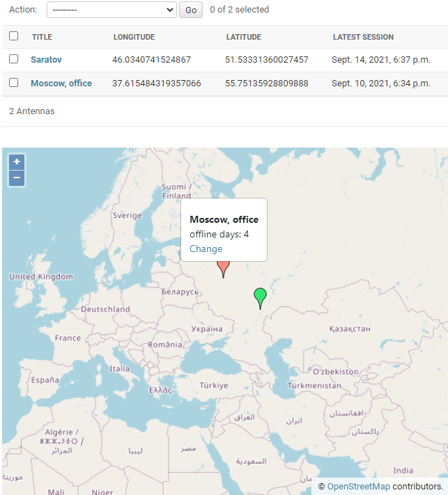

# DjangoAdminGeomap library
[](https://github.com/vb64/django.admin.geomap/actions?query=workflow%3Ageomap-pep257)
[](https://github.com/vb64/django.admin.geomap/actions?query=workflow%3Adjango3)
[](https://www.codacy.com/gh/vb64/django.admin.geomap/dashboard?utm_source=github.com&amp;utm_medium=referral&amp;utm_content=vb64/django.admin.geomap&amp;utm_campaign=Badge_Grade)
[](https://www.codacy.com/gh/vb64/django.admin.geomap/dashboard?utm_source=github.com&utm_medium=referral&utm_content=vb64/django.admin.geomap&utm_campaign=Badge_Coverage)

The free, open-source DjangoAdminGeomap library is designed to display objects on the map in the Django views and admin site.



There is a full-fledged multifunctional GIS framework [GeoDjango](https://docs.djangoproject.com/en/3.2/ref/contrib/gis/).
When is used in the Django admin site, you can display objects on the map.
However, GeoDjango has a large [list of dependencies](https://docs.djangoproject.com/en/3.2/ref/contrib/gis/install/#requirements) on various libraries
and the specifics of installing these libraries on various platforms.

If you only need to display objects on the map in the Django admin site, then you can use the DjangoAdminGeomap library.
It has no additional requirements for the names and data types of fields in the database tables, and there are no installation dependencies.

DjangoAdminGeomap uses the [OpenLayers](https://openlayers.org/) JavaScript framework to display map data.
The source of the cartographic data is the data of the [OpenStreetMap project](https://www.openstreetmap.org/).

## Installation

```bash
pip install django-admin-geomap
```

After installation, you need to plug the library into your Django project by making changes to the `settings.py` file.

## Changes to settings.py

To connect DjangoAdminGeomap to your project, add `'django_admin_geomap'` to the `INSTALLED_APPS` list  in your `settings.py` file.

```python

INSTALLED_APPS = (

...

  'django_admin_geomap',
)
```

## Initial data

Let's say we have a table in the database, the records of which contain data about coordinates.

```python
# models.py
from django.db import models

class Location(models.Model):
    name = models.CharField(max_length=100)
    lon = models.FloatField()  # longitude
    lat = models.FloatField()  # latitude

```

On the main page of the site and when working with this table in the admin panel, we want to see a map with objects from this table located on it.

## Main page with a list of objects on the map

To enable the display of `Location` objects on the map, you need to make changes to the model class in the `models.py` file.

Add the `django_admin_geomap.GeoItem` "mixin" class to the inheritance list of the `Location` class and define two properties:` geomap_longitude` and `geomap_latitude`.
These properties should return the longitude and latitude of the object as a string.

```python
# models.py
from django.db import models
from django_admin_geomap import GeoItem

class Location(models.Model, GeoItem):

    @property
    def geomap_longitude(self):
        return '' if self.lon is None else str(self.lon)

    @property
    def geomap_latitude(self):
        return '' if self.lon is None else str(self.lat)
```

After making these changes to the definition of the model, you can display a map with objects from the `Location` table in an arbitrary view.
To do this, you need to include the file `geomap/common.html` in the page template. For example, the site root page template `home.html` might look like this:

```html
<!DOCTYPE html>
<html lang="en">

<head>
<title>DjangoAdminGeomap example</title>
</head>

<body>
Hello, OpenStreetMap!
<div></div>
</body>

</html>
```

In the view function, you need to pass to this template the context formed by calling the `geomap_context` function.
As a required argument to the function, you need to pass an iterable sequence of objects derived from the class `django_admin_geomap.GeoItem` to display on the map.
For example a list or Django QuerySet.

```python
# views.py
from django.shortcuts import render
from django_admin_geomap import geomap_context

from .models import Location


def home(request):
    return render(request, 'home.html', geomap_context(Location.objects.all()))
```

On the root page of the site, a map with markers in the locations of these objects will be displayed.

The `geomap_context` function accepts additional named arguments to customize the properties of the map.

-   map_longitude: map center longitude, default is "0.0"
-   map_latitude: map center latitude, default is "0.0"
-   map_zoom: map zoom level, default is "1"
-   map_height: vertical map size, default is "500px"

## List of objects on the map in the admin panel

To display a map with objects in the site admin panel in the admin settings file `admin.py`, when registering a model, you need to use the` django_admin_geomap.ModelAdmin` class.

```python
# admin.py
from django.contrib import admin
from django_admin_geomap import ModelAdmin
from .models import Location

admin.site.register(Location, ModelAdmin)
```

After making these changes, in the admin panel on the page with a list of `Location` objects, a map with markers at the locations of these objects will be displayed under the table.

## Displaying the object on the map in the edit form in the admin panel

To display an object on the map in the edit/view form, you must additionally specify the field IDs in the Django form, which contain the longitude and latitude values of the object.

For our `Location` class, the Django admin automatically assigns the IDs` id_lon` and `id_lat` to these form fields. The following changes need to be made to the `admin.py` file.

```python
# admin.py
from django.contrib import admin
from django_admin_geomap import ModelAdmin
from .models import Location

class Admin(ModelAdmin):
    geomap_field_longitude = "id_lon"
    geomap_field_latitude = "id_lat"

admin.site.register(Location, Admin)
```

After making these changes, in the admin panel on the page for viewing/editing the `Location` object, a map with a marker at the location of the object will be displayed.

When editing, you can change the position of an object by dragging its icon across the map with the mouse (you need to move the mouse cursor over the bottom of the icon until a blue dot appears on it).

When adding a new object, its position can be set by clicking on the map. Further, the marker of the new object can be dragged, similar to editing.

## Additional customization

The library allows you to customize the view of the map and objects by setting special properties for the model class and the `django_admin_geomap.ModelAdmin` class.

### Object icon on the map

The `geomap_icon` property of the model class sets the path to the marker icon. You can use different icons depending on the state of a particular object.

The default is `https://maps.google.com/mapfiles/ms/micons/red.png`.

```python
# models.py
from django.db import models
from django_admin_geomap import GeoItem

class Location(models.Model, GeoItem):

    @property
    def geomap_icon(self):
        return self.default_icon
```

### Text in a pop-up panel when you click on a marker on the map

When you click on a marker on the map, a pop-up panel is displayed. The HTML code used in this panel can be set by defining three properties on the model class.

-   `geomap_popup_common` displayed in regular views
-   `geomap_popup_view` displayed in the admin panel for a user without permission to edit the object
-   `geomap_popup_edit` displayed in the admin panel for a user who has permission to edit

By default, all these properties return the string representation of the object.

```python
# models.py
from django.db import models
from django_admin_geomap import GeoItem

class Location(models.Model, GeoItem):

    @property
    def geomap_popup_view(self):
        return "<strong>{}</strong>".format(str(self))

    @property
    def geomap_popup_edit(self):
        return self.geomap_popup_view

    @property
    def geomap_popup_common(self):
        return self.geomap_popup_view
```

### New object icon

The `geomap_new_feature_icon` property of the `django_admin_geomap.ModelAdmin` class sets the path to the marker icon when adding a new object in the admin panel.

```python
# admin.py
from django_admin_geomap import ModelAdmin

class Admin(ModelAdmin):
    geomap_new_feature_icon = "/myicon.png"
```

### Default map zoom level and center of the map when displaying a list of objects in the admin panel

You can change the zoom level and position of the center of the map by setting the properties `geomap_default_longitude`,` geomap_default_latitude` and `geomap_default_zoom` in the class `django_admin_geomap.ModelAdmin`.

By default, the center of the map is located at the point with coordinates "0.0", "0.0" and the scale is "1".

```python
# admin.py
from django_admin_geomap import ModelAdmin

class Admin(ModelAdmin):
    geomap_default_longitude = "95.1849"
    geomap_default_latitude = "64.2637"
    geomap_default_zoom = "3"
```

### Default map zoom level when editing/viewing an object in the admin panel

In object edit form the center of the map coincides with the location of the object. The zoom level of the map can be set by using the `geomap_item_zoom` property of the `django_admin_geomap.ModelAdmin` class.

The default is "13".

```python
# admin.py
from django_admin_geomap import ModelAdmin

class Admin(ModelAdmin):
    geomap_item_zoom = "10"
```

### Vertical map size in the admin panel

When displayed, the map occupies the maximum possible horizontal size. The vertical size can be set via the `geomap_height` property of the `django_admin_geomap.ModelAdmin` class.
The value must be a string valid in the CSS style definition.

The default is "500px".

```python
# admin.py
from django_admin_geomap import ModelAdmin

class Admin(ModelAdmin):
    geomap_height = "300px"
```

## Usage example

You can run an example of using the library running on your local host.

On the Windows platform, you must first install the following programs.

-   [Python3](https://www.python.org/downloads/release/python-3712/)
-   GNU [Unix Utils](http://unxutils.sourceforge.net/) for operations via makefile
-   [Git for Windows](https://git-scm.com/download/win) to access the source code repository.

Then clone the repository and run the installation, specifying the path to Python 3.

```bash
git clone git@github.com:vb64/django.admin.geomap.git
cd django.admin.geomap
make setup PYTHON_BIN=/usr/bin/python3
```

Collect media files and create a database.

```bash
make static
make db
```

Create a database superuser by specifying a login and password for it.

```bash
make superuser
```

Run example.

```bash
make example
```

Open `http://127.0.0.1:8000/` in a browser to view the example site.
To enter the admin panel `http://127.0.0.1:8000/admin/` you need to use the login and password that were set when creating the superuser.
