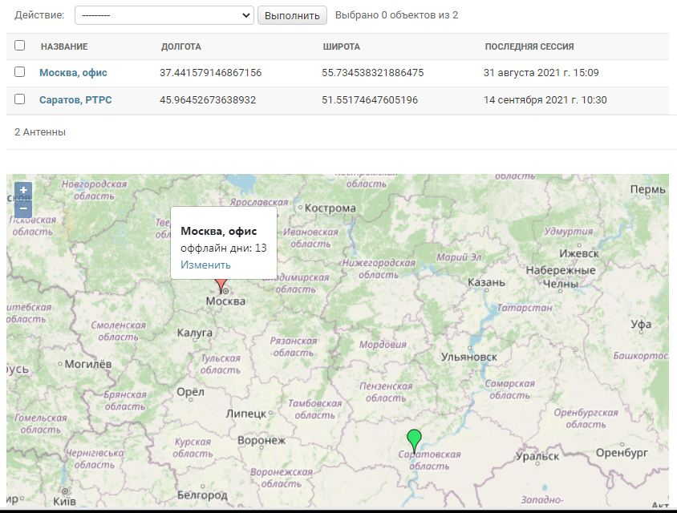

# Библиотека django-admin-geomap

Бесплатная, с открытым исходным кодом библиотека django-admin-geomap предназначена для отображения объектов на карте в админке Django.



Существует полноценный многофункциональный ГИС фреймворк [GeoDjango](https://docs.djangoproject.com/en/3.2/ref/contrib/gis/).
При его использовании в админке Django можно отображать объекты на карте.
Однако GeoDjango имеет большой [список зависимостей](https://docs.djangoproject.com/en/3.2/ref/contrib/gis/install/#requirements) от различных библиотек
и особенности установки этих библиотек на различных платформах.

Если вам требуется только отображение объектов на карте в админке Django, то можно использовать библиотеку django-admin-geomap. 
У нее нет дополнительных требований к именам и типам данных полей в таблицах базы данных и отсутствуют зависимости при установке.

Для отображения картографических данных django-admin-geomap использует JavaScript фреймворк [OpenLayers](https://openlayers.org/).
Источником картографических данных являются данные проекта [OpenStreetMap](https://www.openstreetmap.org/).

## Установка

```
pip install django-admin-geomap
```

После установки нужно подключить библиотеку к вашему проекту Django, внеся изменения в файл `settings.py`.

## Изменения в settings.py

Для подключения django-admin-geomap к вашему проекту нужно добавить в файл `settings.py` в ключ `TEMPLATES` путь на каталог `templates` библиотеки.

```python
TEMPLATES = [
  {
    'DIRS': ['path/to/installed/django_admin_geomap/templates'],
  },
]
```

Пример такого подключения можно посмотреть в файле [example/settings.py](https://github.com/vb64/django.admin.geomap/blob/3fb078d231517f368158ff4fd2c63c11092af979/example/settings.py#L43).

Включать библиотеку в список `INSTALLED_APPS` в `settings.py` не нужно.

## Исходные данные

Допустим, у нас в БД имеется таблица, записи которой содержат данные о координатах.

```python
# models.py
from django.db import models

class Location(models.Model):
    name = models.CharField(max_length=100)
    lon = models.FloatField()  # долгота
    lat = models.FloatField()  # широта

```

При работе с этой таблицей в админке мы хотим видеть карту с расположенными на ней объектами из этой таблицы.

## Отображение списка объектов на карте

Чтобы включить отображение объектов `Location` на карте в админке Django нужно внести изменения в класс модели в файле `models.py` и в файл настроек админки `admin.py`.

В список наследования класса `Location` нужно добавить "примесный" класс `django_admin_geomap.GeoItem` и определить два свойства: `geomap_longitude` и `geomap_latitude`.
Эти свойства должны возвращать долготу и широту объекта в виде строки.

```python
# models.py
from django.db import models
from django_admin_geomap import GeoItem

class Location(models.Model, GeoItem):

    @property
    def geomap_longitude(self):
        return str(self.lon)

    @property
    def geomap_latitude(self):
        return str(self.lat)
```

В файле `admin.py` при регистрации модели нужно использовать класс `django_admin_geomap.ModelAdmin`.

```python
# admin.py
from django.contrib import admin
from django_admin_geomap import ModelAdmin
from .models import Location

admin.site.register(Location, ModelAdmin)
```

После внесения данных изменений в админке на странице со списком объектов `Location` под таблицей будет отображаться карта с маркерами в местах расположения этих объектов.

## Отображение редактируемого объекта на карте

Для отображения на карте объекта в форме редактирования/просмотра необходимо дополнительно указать идентификаторы полей в форме Django, в которых находятся значения долготы и широты объекта.

Для нашего класса `Location` админка Django автоматически присваивает этим полям формы идентификаторы `id_lon` и `id_lat`. В файл `admin.py` нужно внести следующие изменения.

```python
# admin.py
from django.contrib import admin
from django_admin_geomap import ModelAdmin
from .models import Location

class Admin(ModelAdmin):
    geomap_field_longitude = "id_lon"
    geomap_field_latitude = "id_lat"

admin.site.register(Location, Admin)
```

После внесения данных изменений в админке на странице просмотра/редактирования объекта `Location` будет отображаться карта с маркером в месте расположения объекта.

При редактировании можно менять положение объекта, перетаскивая его значок по карте при помощи мыши (нужно навести курсор мыши на нижнюю часть значка до появления на нем синей точки).

При добавлении нового объекта его положение можно задать кликом на карте. Далее маркер нового объекта можно перетаскивать, аналогично редактированию.

## Дополнительные настройки

Библиотека позволяет настраивать вид карты и объектов, задавая специальные свойства у класса модели и класса `django_admin_geomap.ModelAdmin`.

### Значок маркера объекта на карте

Свойство `geomap_icon` у класса модели задает путь на значок маркера. Можно использовать разные значки в зависимости от состояния конкретного объекта.

По умолчанию используется строка `https://maps.google.com/mapfiles/ms/micons/red.png`

```python
# models.py
from django.db import models
from django_admin_geomap import GeoItem

class Location(models.Model, GeoItem):

    @property
    def geomap_icon(self):
        return self.default_icon
```

### Текст во всплывающем блоке при клике мышью по маркеру на карте

Свойства `geomap_popup_view` и `geomap_popup_edit` у класса модели задают HTML код, который используется во всплывающем блоке при клике мышью по маркеру на карте.
Свойство `geomap_popup_view` задает код для пользователя без прав на изменение объекта, а свойство `geomap_popup_edit` - для пользователя, который имеет права на редактирование.

По умолчанию оба свойства возвращают строковое представление объекта.

```python
# models.py
from django.db import models
from django_admin_geomap import GeoItem

class Location(models.Model, GeoItem):

    @property
    def geomap_popup_view(self):
        return "<strong>{}</strong>".format(str(self))

    @property
    def geomap_popup_edit(self):
        return self.geomap_popup_view
```

### Значок маркера нового объекта

Свойство `geomap_new_feature_icon` класса `django_admin_geomap.ModelAdmin` задает путь на значок маркера при добавлении нового объекта.

По умолчанию используется значок для отображения объектов на карте.

```python
# admin.py
from django_admin_geomap import ModelAdmin

class Admin(ModelAdmin):
    geomap_new_feature_icon = "/myicon.png"
```

### Масштаб и центр карты при отображении списка объектов

Вы можете менять масштаб и положение центра карты, задавая свойства `geomap_default_longitude`, `geomap_default_latitude` и `geomap_default_zoom` у класса `django_admin_geomap.ModelAdmin`.

По умолчанию центр карты располагается в точке с координатами "0.0", "0.0" и используется масштаб "1".

```python
# admin.py
from django_admin_geomap import ModelAdmin

class Admin(ModelAdmin):
    geomap_default_longitude = "95.1849"
    geomap_default_latitude = "64.2637"
    geomap_default_zoom = "3"
```

### Масштаб карты при редактировании/просмотре объекта

При редактировании/просмотре объекта центр карты сопадает с местом расположения объекта, а масштаб карты можно задать, используя свойство `geomap_item_zoom` у класса `django_admin_geomap.ModelAdmin`.

По умолчанию этот масштаб равен "13".

```python
# admin.py
from django_admin_geomap import ModelAdmin

class Admin(ModelAdmin):
    geomap_item_zoom = "10"
```

### Размер карты по вертикали

При отображении карта занимает максимально возможный размер по горизонтали, а размер по вертикали можно задать через свойство `geomap_height` у класса `django_admin_geomap.ModelAdmin`.
Значение должно быть строкой, допустимой в определении CSS стиля.

По умолчанию "500px".

```python
# admin.py
from django_admin_geomap import ModelAdmin

class Admin(ModelAdmin):
    geomap_height = "300px"
```
